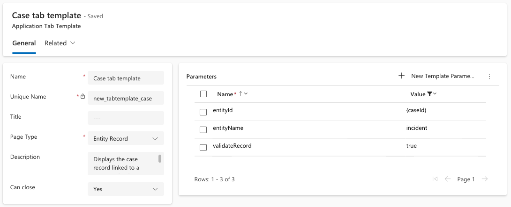
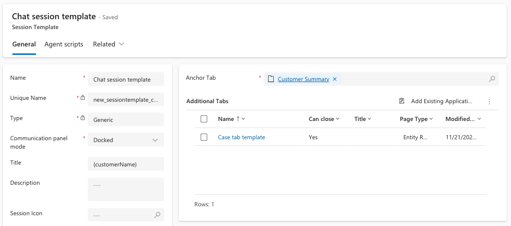
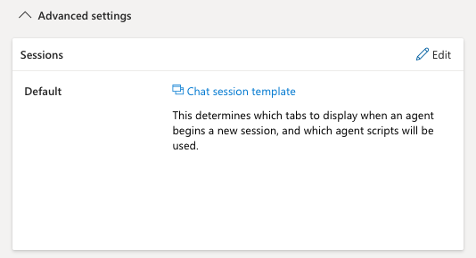
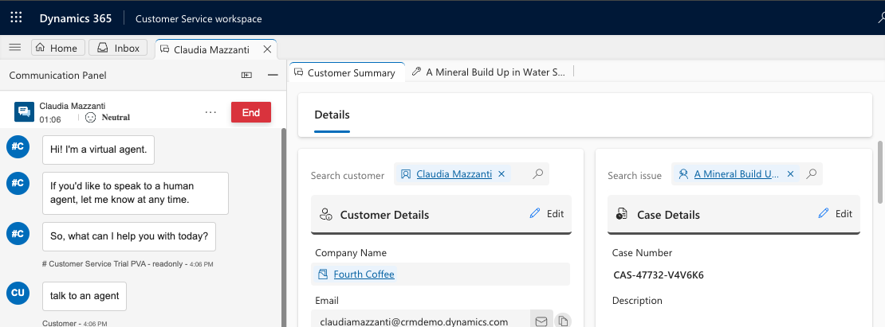
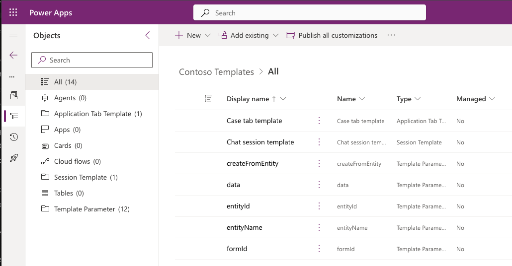

## Requirements
Automatically load the linked case when accepting a live chat as an additional tab next to Customer summary tab.  
This should be applicable to conversations with a linked case. If the conversation has no linked case, then no further action is required.  
 

## Step 1: Setup a tab template to load the case form passing the caseId.
Log in to Customer Service admin center with System Administrator credentials.  
Go to Workspace under Agent experience, and then Application tab templates.  
Click New and create a tab template with the following:  
Page Type: Entity Record  
Can close: Yes  
entityId : {caseId}  
entityName: incident  
validateRecord: true  
Note: validateRecord parameter set to true avoids loading a case form if caseId doesn’t exist.  

Example (showing only parameters that contains values):  

 
## Step 2: Setup a session template with the new case tab template.\
Go to Workspace under Agent experience, and then Session templates.  
Click New and create a session template with the following:  
Type: Generic  
Communication panel mode: Docked  
Title: {customerName}  
Anchor Tab: Customer Summary  
Additional Tabs: Case tab template (created in Step 1)  
Example:  

 
## Step 3: Replace the out of the box session template with the newly created template
Go to Workstreams under Customer support  
Open the corresponding workstream for Chat channel.  
Expand Advanced settings and replace the session template with the newly created template.  
Click Save and Close to apply the settings.  
Example:  

## Testing:
 Accepting a conversation that already has a linked case should automatically load the linked case as a tab.  

## Documentation:
https://learn.microsoft.com/en-us/dynamics365/customer-service/administer/application-tab-templates#entity-record
https://learn.microsoft.com/en-us/dynamics365/customer-service/administer/session-templates#create-a-session-template
https://learn.microsoft.com/en-us/dynamics365/customer-service/administer/create-workstreams#configure-advanced-settings
 
 
## Appendix: Application Lifecycle Management
The session template, tab templates and their corresponding parameters can be configured in a lower environment (sandbox) and moved to a higher environment (production) via solutions.  
When adding the newly created session template to a solution, it should automatically include the related components (dependencies).  
 
Example: Adding the session template to a solution will bring the session template parameters, tab template, and tab template parameters:  
 
 